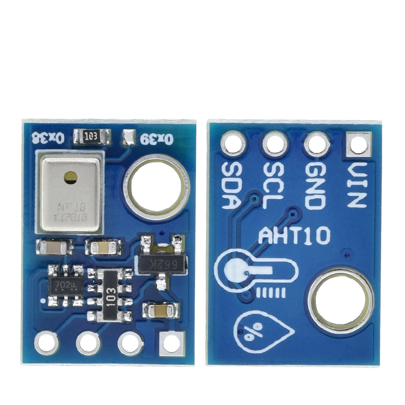
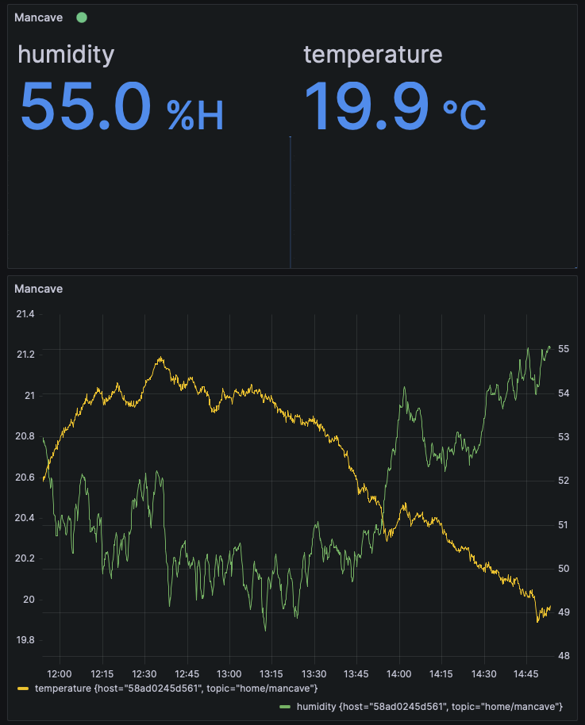

# AHT10 Temperature and Humidity Sensor

This device can be found [AHT10 High Precision Digital Temperature and Humidity Sensor Measurement Module I2C Communication Replace DHT11 SHT20 AM2302](https://www.aliexpress.com/item/4000125110813.html) and at time of purchase cost £0.56 per item.

{ width="800" }

??? info "Breadboard Sketch"

    { width="800" }

???+ tip "Arduino Code"

    The below code snippet will read the temperature and humidity from the sensor every 10 seconds and print it to serial.

    You'll need to have the following libraries installed:

    ```ini
    [env:nodemcuv2]
    platform = espressif8266
    board = nodemcuv2
    framework = arduino
    monitor_speed = 115200
    lib_deps =
        adafruit/Adafruit AHTX0@^2.0.5
    ```

    ```c++
    #include <Arduino.h>
    #define LED_BUILTIN D4  // Pin D4 or GPIO2 work. We could use LED_BUILTIN for other platforms. See https://arduino.stackexchange.com/a/38979
    #include <Adafruit_AHTX0.h>

    int setBuiltInDiode(int state);

    // intialise the DHT sensor and global variables to update in loop
    ulong last_updated = 0;
    const long update_interval = 10000;  // 10secs

    Adafruit_AHTX0 aht10;
    sensors_event_t humidity, temp;


    void setup() {
    // open the serial port at 115200 bps:
    Serial.begin(115200);
    // initialize LED digital pin as an output.
    pinMode(LED_BUILTIN, OUTPUT);
    // start the sensor
    aht10.begin();
    }

    void loop() {
    Serial.println("Arduino has been running for " + String(time(NULL)) + " secs");

    unsigned long currentMillis = millis();
    if (currentMillis - last_updated >= update_interval) {
        if (uint(aht10.getStatus()) == 255) {
        Serial.println("ERROR: Unable to connect to AHT sesor. Device offline.");
        }
        else {
        last_updated = currentMillis;
        aht10.getEvent(&humidity, &temp);
        Serial.println("Temp: " + String(temp.temperature) + " Humidity: " + String(humidity.relative_humidity));
        }
        Serial.println("Sensor Status: " + String(aht10.getStatus()));
    }

    // arithmatically flip between 1/0
    setBuiltInDiode(1 - digitalRead(LED_BUILTIN));

    delay(1000);
    }

    int setBuiltInDiode(int state) {
    digitalWrite(LED_BUILTIN, state);
    return digitalRead(LED_BUILTIN);
    }
    ```

## Connecting to MQTT Backend

Using the provided [infra/docker-compose.yaml](https://github.com/darth-veitcher/arduino-snippets/tree/main/infra/docker-compose.yaml) within this repository as an assumed target we are going to send temperature and humidity sensor data to a [mosquitto MQTT](https://mosquitto.org/) backend to then be displayed in a Grafana interface.

The below code will connect to the WiFi and then serialise to JSON the measurements before sending through the results to a specified MQTT broker.

??? info "docker-compose.yaml"

    ```yaml
    
    ```

??? tip "main.cpp"

    ```c++
    #include <Arduino.h>
    #ifdef ESP8266
    #define LED_BUILTIN D4  // Pin D4 or GPIO2 work. We could use LED_BUILTIN for other platforms. See https://arduino.stackexchange.com/a/38979
    #include <ESP8266WiFi.h>
    #else
    #include <WiFi.h>
    #endif
    #include <Adafruit_AHTX0.h>


    #include <ArduinoJson.h>
    #include <WiFiClientSecure.h>
    #include <AsyncMqttClient.h>

    /****** Device Identifiers and Topic *******/
    const char* siteId = "Mancave";
    const char* deviceId = "desk";
    const char* mqtt_topic = "home/mancave";

    /****** WiFi Connection Details *******/
    const char* ssid = "IoT";
    const char* password = "mysecretpassword";

    /******* MQTT Broker Connection Details *******/
    const char* mqtt_server = "myserver-hostname.local";
    // const char* mqtt_username = "your_mqtt_client_username";
    // const char* mqtt_password = "your_mqtt_client_password";
    const int mqtt_port = 1883;

    /**** Secure WiFi Connectivity Initialisation *****/
    WiFiClientSecure espClient;

    /**** MQTT Client Initialisation *****/
    AsyncMqttClient mqttClient;

    unsigned long lastMsg = 0;
    #define MSG_BUFFER_SIZE (50)
    char msg[MSG_BUFFER_SIZE];

    /************* Connect to WiFi ***********/
    void setup_wifi() {
    delay(10);
    Serial.print("\nConnecting to ");
    Serial.println(ssid);

    WiFi.mode(WIFI_STA);
    WiFi.begin(ssid, password);

    while (WiFi.status() != WL_CONNECTED) {
        delay(500);
        Serial.print(".");
    }
    randomSeed(micros());
    Serial.println("\nWiFi connected\nIP address: ");
    Serial.println(WiFi.localIP());
    }

    // Function Definitions
    int setBuiltInDiode(int state);

    // intialise the DHT sensor and global variables to update in loop
    ulong last_updated = 0;
    const long update_interval = 10000;  // 10secs

    Adafruit_AHTX0 aht10;
    sensors_event_t humidity, temp;


    void setup() {
    // open the serial port at 115200 bps:
    Serial.begin(115200);
    // initialize LED digital pin as an output.
    pinMode(LED_BUILTIN, OUTPUT);
    // start the sensor
    aht10.begin();

    setup_wifi();
    mqttClient.setServer(mqtt_server, mqtt_port);
    }

    void loop() {
    // Serial.println("Arduino has been running for " + String(time(NULL)) + " secs");

    while (!WiFi.isConnected()) {
        Serial.println("Waiting for WiFi ...");
        delay(1000);
    }

    mqttClient.connect();

    unsigned long currentMillis = millis();
    if (currentMillis - last_updated >= update_interval) {
        if (uint(aht10.getStatus()) == 255) {
        Serial.println("ERROR: Unable to connect to AHT sesor. Device offline.");
        }
        else {
        last_updated = currentMillis;
        aht10.getEvent(&humidity, &temp);
        Serial.println("Temp: " + String(temp.temperature) + " Humidity: " + String(humidity.relative_humidity));
        }
        Serial.println("Sensor Status: " + String(aht10.getStatus()));

        DynamicJsonDocument doc(1024);

        doc["deviceId"] = deviceId;
        doc["siteId"] = siteId;
        doc["humidity"] = humidity.relative_humidity;
        doc["temperature"] = temp.temperature;

        char mqtt_message[128];
        serializeJson(doc, mqtt_message);
        Serial.println(mqtt_message);

        mqttClient.publish(mqtt_topic, 1, true, mqtt_message);
    }

    // arithmatically flip between 1/0
    setBuiltInDiode(1 - digitalRead(LED_BUILTIN));

    delay(1000);
    }

    int setBuiltInDiode(int state) {
    digitalWrite(LED_BUILTIN, state);
    return digitalRead(LED_BUILTIN);
    }
    ```


